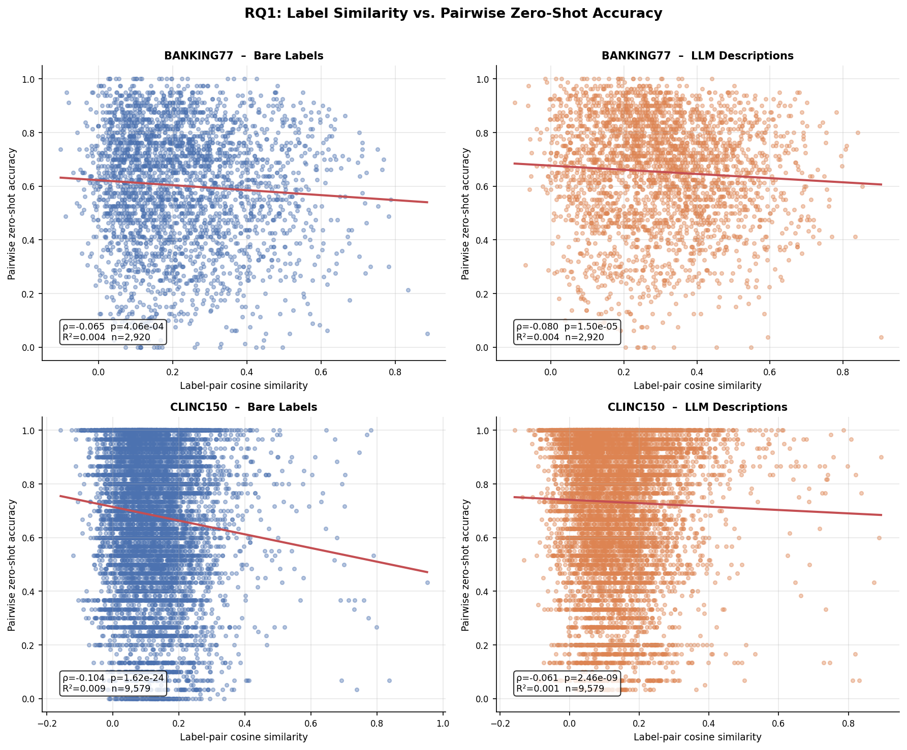
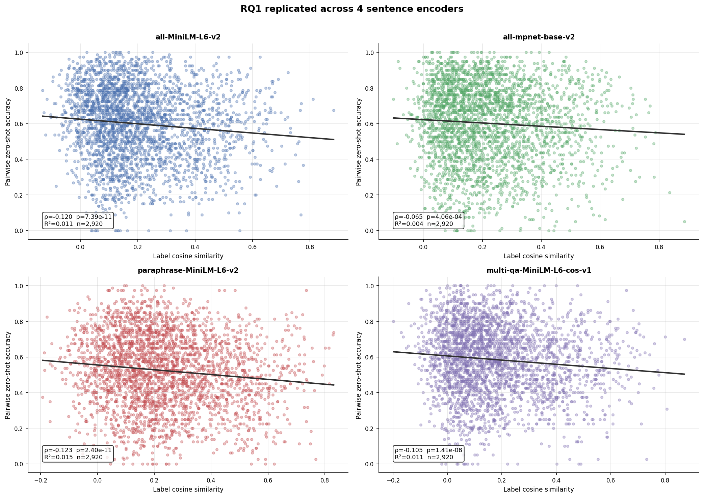
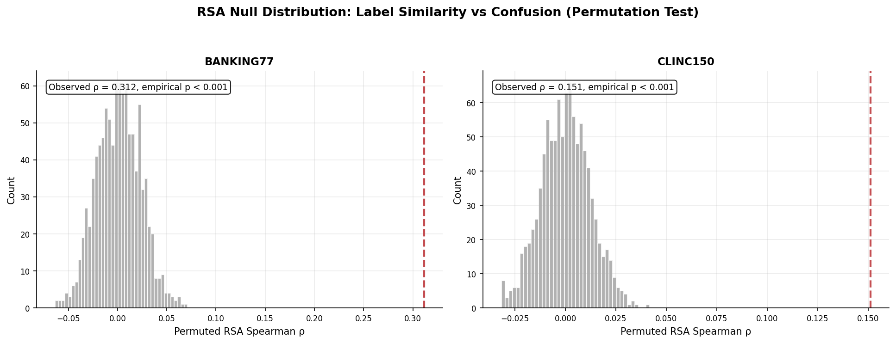
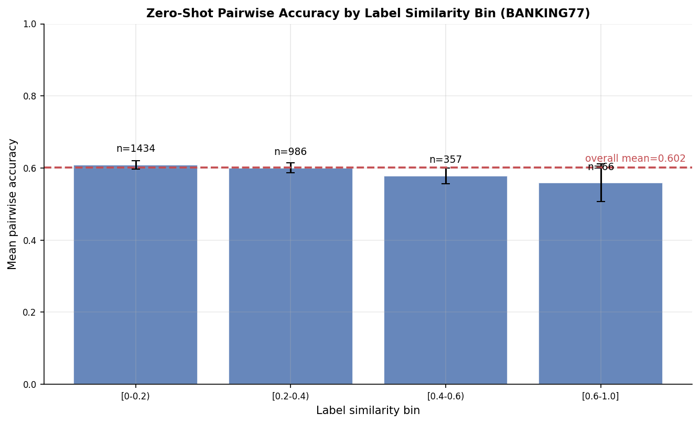
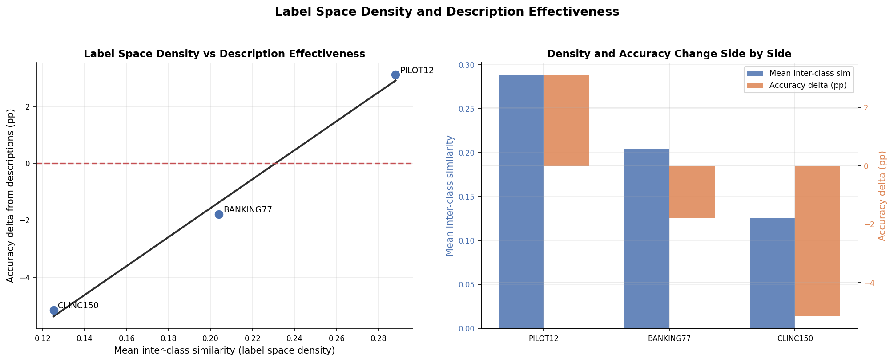
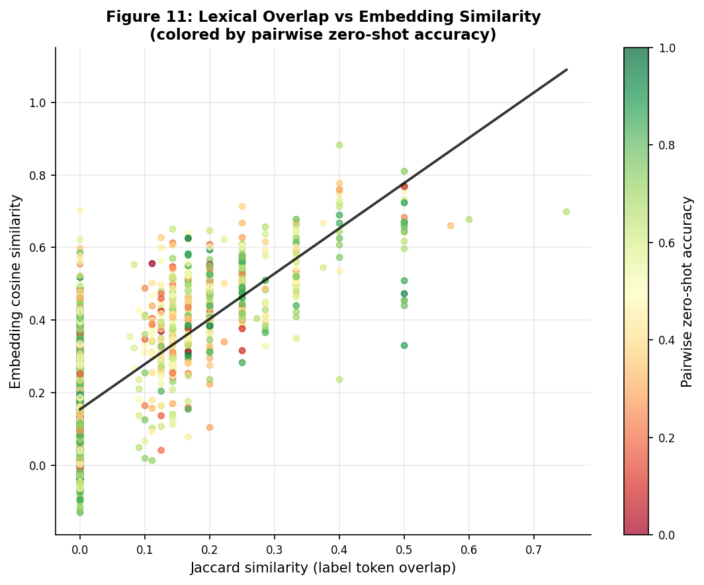
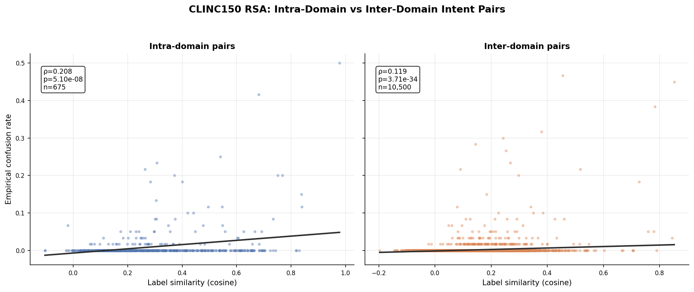
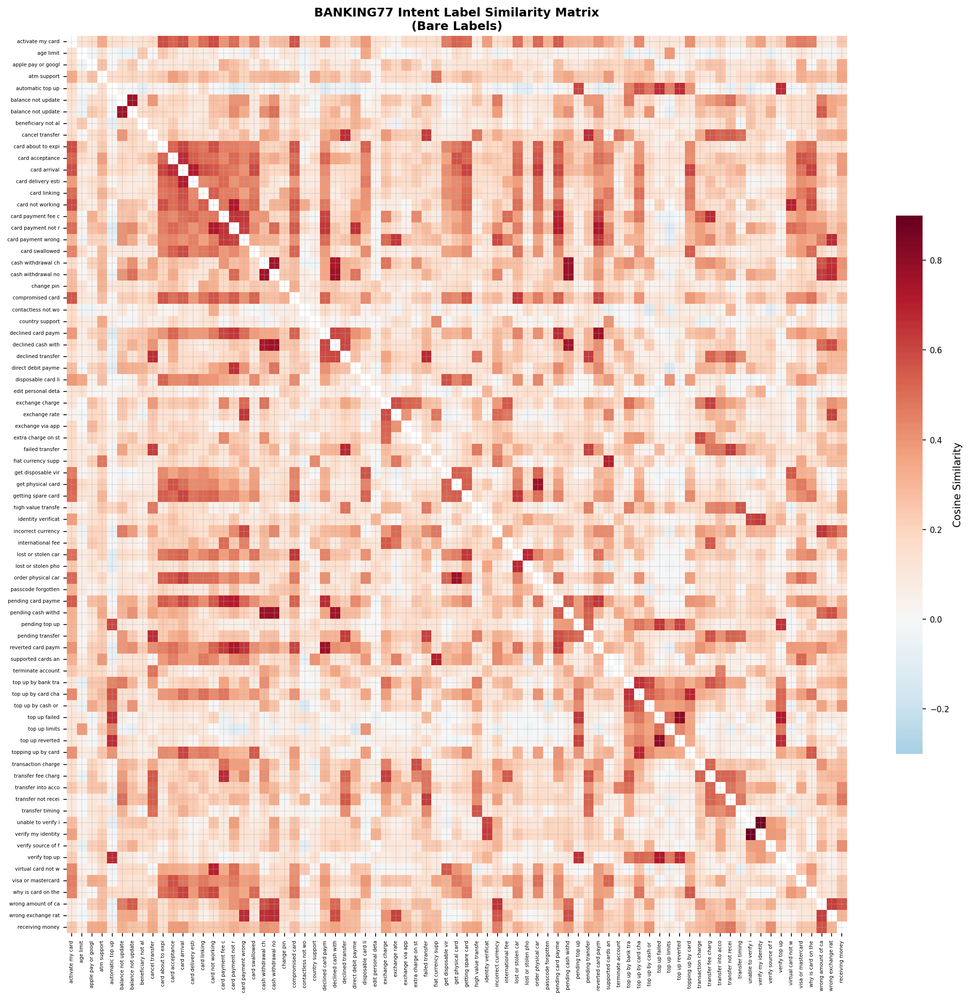

# Are Label Embeddings Discriminative Enough?
### Probing Semantic Label Similarity as a Source of Fine-Grained Failure
### in Zero-Shot Intent Detection

Kasfi Ahamed
School of Information Technology, Deakin University
SIT770 Applied Machine Learning, 2026

---

## Overview

Zero-shot intent detection assigns user utterances to the nearest intent label in embedding space, and this mechanism assumes that label embeddings are sufficiently discriminative to support reliable fine-grained classification. This study examines that assumption directly by evaluating whether geometric proximity among label embeddings is associated with downstream classification error.

The empirical analysis is conducted on BANKING77 (77 intents, 3,080 test samples) and CLINC150 (150 intents, 2,790 test samples), and is organized around three questions: **RQ1.** Do intent label pairs with higher cosine similarity exhibit systematically lower pairwise zero-shot accuracy? **RQ2.** Does the label similarity matrix structurally predict the empirical confusion matrix via Representational Similarity Analysis? **RQ3.** Do LLM-generated descriptions increase embedding separation, and is their effect moderated by label-space density?

---

## Repository Structure

```text
.
├── README.md
├── Main Research/
│   ├── Notebook/
│   │   └── label_embeddings_experiment.ipynb
│   ├── outputs/
│   │   └── figures/
│   └── requirements.txt
└── Proposal/
    ├── Notebook/
    ├── Outputs/
    └── README.md
```

---

## Key Findings

RQ1 shows a consistent negative association between label similarity and pairwise zero-shot performance, with Spearman rho in [-0.08, -0.32]. For the full BANKING77 and CLINC150 configurations, all p-values are < 10^-8, and a lexical-overlap control indicates the effect is semantic: partial rho controlling for Jaccard = -0.078, p = 2.34e-05.

RQ2 indicates that label geometry predicts confusion structure, with rho_RSA in [+0.15, +0.64], permutation z >= 12.5, and p < 0.001. Domain-aware decomposition on CLINC150 shows intra-domain rho = +0.208 versus inter-domain rho = +0.119, indicating a 1.75x stronger within-domain structural alignment.

RQ3 demonstrates that description effectiveness depends on label-space density: +3.1pp in the pilot subset (s-bar=0.288), -1.79pp on full BANKING77 (s-bar=0.204), and -5.16pp on CLINC150 (s-bar=0.125).

---

## Results

| Dataset | Condition | Acc | RQ1 rho | R2 | RSA rho |
|---|---|---|---|---|---|
| Pilot (12 int.) | Bare Labels | .744 | -.319 | .079 | +.640 |
| Pilot (12 int.) | LLM Descriptions | .719 | -.225 † | .056 | +.408 |
| BANKING77 | Bare Labels | .586 | -.120 | .011 | +.312 |
| BANKING77 | LLM Descriptions | .433 | -.322 | .106 | +.241 |
| CLINC150 | Bare Labels | .699 | -.082 | .004 | +.151 |
| CLINC150 | LLM Descriptions | .607 | -.236 | .057 | +.174 |

Caption: dagger = p > 0.05 (insufficient power, n = 66 pairs)

| Encoder | Acc | RQ1 rho | p | RSA rho |
|---|---|---|---|---|
| all-MiniLM-L6-v2 | .586 | -.120 | < 10^-10 | .312 |
| all-mpnet-base-v2 | .588 | -.065 | < 10^-3 | .318 |
| paraphrase-MiniLM-L6-v2 | .509 | -.123 | < 10^-10 | .320 |
| multi-qa-MiniLM-L6-cos-v1 | .571 | -.105 | < 10^-8 | .321 |

| Dataset | Mean sim (s-bar) | Acc (bare) | Delta Acc |
|---|---|---|---|
| Pilot (12 intents) | 0.288 | .744 | +3.1 pp |
| BANKING77 (77 int.) | 0.204 | .586 | -1.8 pp |
| CLINC150 (150 int.) | 0.125 | .699 | -5.2 pp |

---

## Figures

Figure 1. Label-pair cosine similarity versus pairwise zero-shot accuracy across all four conditions. Regression line and Spearman rho annotated per panel. Negative slope is consistent across all datasets and conditions.


Figure 2. RQ1 replicated across four sentence encoders (BANKING77, bare labels). All four encoders show a negative Spearman rho, all significant at p <= 0.0004. RSA rho stable within 0.009 across architectures.


Figure 3. RSA permutation null distributions for BANKING77 (left) and CLINC150 (right). Red dashed line marks the observed rho. z-scores of 14.0 and 12.5 confirm the result is not a statistical artefact.


Figure 4. Mean pairwise zero-shot accuracy by label similarity bin (BANKING77, bare labels). Monotone decline from 60.5% in [0.0, 0.2) to 56.2% in [0.4, 0.6) confirms the effect is continuously graded.


Figure 5. Mean inter-class cosine similarity versus accuracy change from Gemini-2.5-Flash descriptions across three dataset scales. The monotone relationship confirms label-space density moderates description effectiveness.


Figure 6. Cosine similarity and Jaccard similarity as competing predictors of pairwise accuracy. Adding Jaccard yields R2 = 0.0108, identical to the cosine-only model, confirming the effect is semantic rather than lexical.


Figure 7. CLINC150 intra-domain RSA rho = +0.208 versus inter-domain rho = +0.119. Within-domain label geometry is 1.75x more predictive of confusion, mechanistically explaining the weaker aggregate RSA.


Figure 8. Cosine similarity heatmap across all 77 BANKING77 intent label embeddings. High-similarity clusters correspond to the confusion hotspots identified in the error analysis.


---

## Reproducibility

Install dependencies with `pip install -r "Main Research/requirements.txt"`. Dataset loading is automatic and uses PolyAI CSV for BANKING77 and CLINC OOS-Eval JSON for CLINC150, with silent fallback between sources. A Gemini API key is required only for Sections 9 and 10c to regenerate descriptions; pre-computed descriptions are embedded in the notebook for offline use. All encoders are frozen and no fine-tuning is applied at any stage. End-to-end runtime is approximately 20-40 minutes on a standard CPU.

---

## Citation

```
Ahamed, K. (2026). Are Label Embeddings Discriminative Enough?
Probing Semantic Label Similarity as a Source of Fine-Grained Failure
in Zero-Shot Intent Detection. SIT770 Applied Machine Learning,
Deakin University.
```

---

## Acknowledgements

This work was completed as part of SIT770 (Applied Machine Learning) at Deakin University. The author thanks the open-source communities behind sentence-transformers, BANKING77, and CLINC150.
